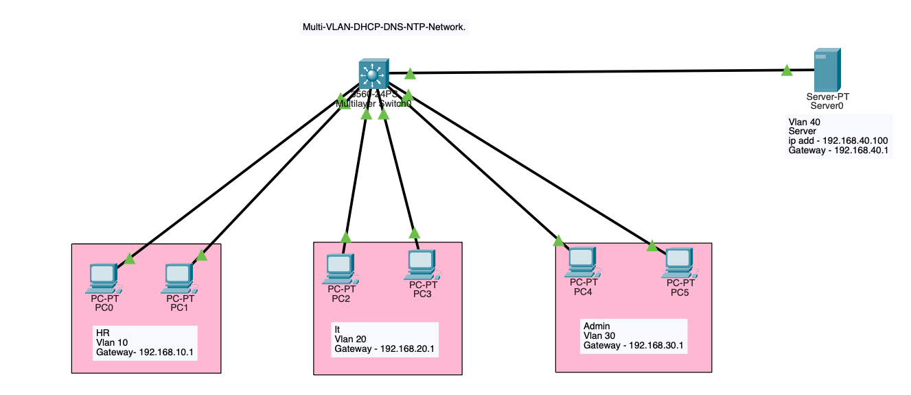
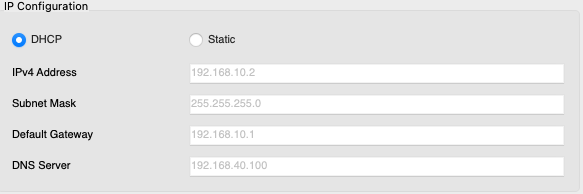

# Multi VLAN Enterprise Network

## Overview
Designed and configured a multi-VLAN enterprise network using a Layer 3 switch in Cisco Packet Tracer. Implemented Inter-VLAN Routing, DHCP, DNS, and NTP services for efficient network communication and management.

## Key Features
- Multi-VLAN Network Architecture
- Inter-VLAN Routing using Layer 3 Switching
- Dynamic IP Address Allocation using DHCP
- DNS Server Configuration
- NTP Time Synchronization
- Department-wise Network Segmentation
- End-to-End Connectivity Verification

## Technologies Used
- VLAN
- SVI
- DHCP
- DNS
- NTP
- Layer 3 Switching

## Devices Used
- Cisco 3560 Multilayer Switch
- PCs
- Server
- Cisco Packet Tracer

## Screenshots

### Network Topology

### VLAN Configuration and Ip Interface

### DHCP Configuration

